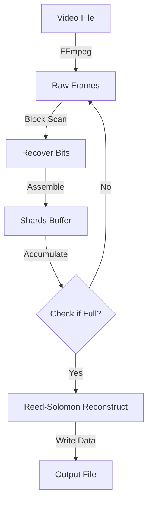

# Decoder Module (`src/decoder.rs`)

The `Decoder` reverses the process, reading a video stream and reconstructing the original binary file.

## Workflow


## Key Logic

### 1. Header Bootstrap
The first frame is special. It contains the `FileHeader`.
**Challenge**: To read the header, we need to know the Block Size.
**Solution**: The header is ALWAYS encoded with a fixed `Block Size = 4`. This allows the decoder to reliably "bootstrap" itself without knowing user settings beforehand.

### 2. Reconstruction
We read frames sequentially. Since we use `ffv1` (lossless) or assume good transmission, we typically get valid data.
```rust
// If we had missing frames, RS would fill in the gaps here
rs.reconstruct(&mut shards_buffer)?;
```

### 3. Integrity Check
We calculate the SHA256 of the output file on-the-fly. At the end, we compare it with the `sha256_hash` stored in the Header.
