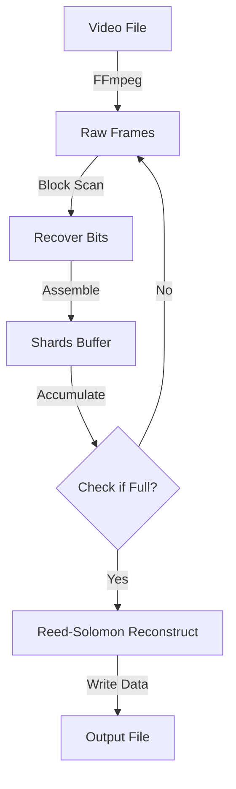

# Decoder Module (`src/decoder.rs`)

The `Decoder` reverses the process, reading a video stream and reconstructing the original binary file.

## Workflow

```mermaid
graph TD
    A[Video File] -->|FFmpeg| B[Raw Frames]
    B -->|Block Scan| C[Recover Bits]
    C -->|Assemble| D[Shards Buffer]
    D -->|Accumulate| E{Check if Full?}
    E -->|No| B
    E -->|Yes| F[Reed-Solomon Reconstruct]
    F -->|Write Data| G[Output File]
```

## Key Logic

### 1. Header Bootstrap
The first frame is special. It contains the `FileHeader`.
**Challenge**: To read the header, we need to know the Block Size.
**Solution**: The header is ALWAYS encoded with a fixed `Block Size = 4`. This allows the decoder to reliably "bootstrap" itself without knowing user settings beforehand.

#### Detailed Example: Header Bootstrap Process
```rust
// Decoder initialization - first frame handling
let mut decoder = Decoder::new();

// Read first frame (special case)
let first_frame = read_frame(&mut input_stream)?;

// Extract FileHeader from first frame
if let Some(header) = extract_header(&first_frame, block_size: 4) {
    println!("Bootstrap complete. Header info:");
    println!("  - Block Size: {}", header.block_size);
    println!("  - Expected Frames: {}", header.expected_frames);
    println!("  - SHA256 Hash: {:?}", header.sha256_hash);
}
```

### 2. Reconstruction
We read frames sequentially. Since we use `ffv1` (lossless) or assume good transmission, we typically get valid data.
```rust
// If we had missing frames, RS would fill in the gaps here
rs.reconstruct(&mut shards_buffer)?;
```

#### Detailed Example: Frame-by-Frame Reconstruction Loop
```rust
let mut shards_buffer = Vec::new();
let mut frame_count = 0;

loop {
    let frame = read_frame(&mut input_stream)?;
    
    // Extract data shards from current frame
    for shard in extract_data_shards(&frame) {
        shards_buffer.push(shard);
    }
    
    frame_count += 1;
    
    // Check if we have enough data to reconstruct
    if shards_buffer.len() >= required_shards { break; }
}

// Perform Reed-Solomon reconstruction
rs.reconstruct(&mut shards_buffer)?;
```

### 3. Integrity Check
We calculate the SHA256 of the output file on-the-fly. At the end, the hash is printed to stdout. If the header's `sha256_hash` field is not `PENDING`, the decoder compares the two values and warns if they differ. In practice, the header hash is currently always set to `PENDING` by the encoder, so automatic integrity verification is not performed; keep the hash printed at encode time separately if you need it.

#### Detailed Example: Integrity Verification Logic
```rust
fn verify_integrity(output_path: &Path, expected_hash: Option<String>) -> Result<(), Error> {
    let actual_hash = calculate_sha256(&output_path)?;
    
    match expected_hash {
        Some(hash) if hash != "PENDING" => {
            if actual_hash != hash {
                eprintln!(
                    "Warning: Integrity check failed!\n"
                    "  Expected: {}\n"
                    "  Actual:   {}",
                    hash, actual_hash
                );
                return Err(Error::IntegrityMismatch);
            }
        },
        _ => {
            println!("Output file written. SHA256: {}", actual_hash);
        }
    }
    
    Ok(())
}
```

---