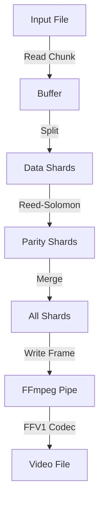

# Encoder Module (`src/encoder.rs`)

The `Encoder` struct handles the transformation of a binary file into a video stream.

## Workflow



## Key Components

### 1. FFmpeg Pipe
We spawn `ffmpeg` as a child process and pipe raw pixel data to its `stdin`.
```rust
let mut child = Command::new("ffmpeg")
    .args(&["-f", "rawvideo", ... "-i", "pipe:0", ...])
    .stdin(Stdio::piped())
    // ...
```

### 2. Reed-Solomon Encoding
We use `reed-solomon-erasure` to add redundancy.
- **Data Shards**: The actual file content.
- **Parity Shards**: Redundant data calculated from Data Shards.
- **Recovery**: If you lose valid data shards, you can replace them with parity shards to reconstruct the original data.

### 3. Block Scaling (`write_frame`)
To protect against compression (h264 re-encoding), we don't write single pixels. We write "blocks".

```rust
// Example: Block Size 4
// 1 Logical Bit -> 4x4 Pixel Area
for dy in 0..block_size {
    for dx in 0..block_size {
        // ... set pixel color ...
    }
}
```
This acts as a physical upscaling filter (Nearest Neighbor), making the "signal" significantly stronger against blurring.
