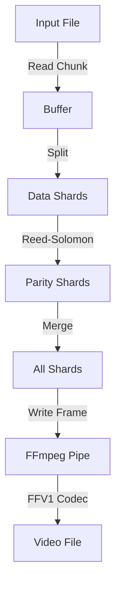

# Encoder Module (`src/encoder.rs`)

The `Encoder` struct handles the transformation of a binary file into a video stream.

## Workflow


```mermaid
graph TD
    A[Input File] -->|Read Chunk| B[Buffer]
    B -->|Split| C[Data Shards]
    C -->|Reed-Solomon| D[Parity Shards]
    D -->|Merge| E[All Shards]
    E -->|Write Frame| F[FFmpeg Pipe]
    F -->|FFV1 Codec| G[Video File]
```

## Key Components

### 1. FFmpeg Pipe
We spawn `ffmpeg` as a child process and pipe raw pixel data to its `stdin`.
```rust
let mut child = Command::new("ffmpeg")
    .args(&["-f", "rawvideo", ... "-i", "pipe:0", ...])
    .stdin(Stdio::piped())
    // ...
```

#### Detailed Example: FFmpeg Process Setup
```rust
use std::process::{Command, Stdio};
use std::fs::File;
use std::io::{Read, Write};

fn spawn_ffmpeg_pipeline(input_path: &Path) -> Result<ChildProcess, Error> {
    let mut child = Command::new("ffmpeg")
        .args(&[
            "-f", "rawvideo",
            "-vcodec", "rawvideo",
            "-pix_fmt", "rgb24",
            "-i", "pipe:0",
            "-c:v", "ffv1",
            "-an", // no audio
            "-y",  // overwrite output
            "output.mp4"
        ])
        .stdin(Stdio::piped())
        .stdout(Stdio::piped())
        .stderr(Stdio::piped())
        .spawn()
        .map_err(Error::SpawnFfmpeg)?;

    let stdin = child.stdin.take().ok_or(Error::NoStdin)?;
    
    Ok(ChildProcess {
        child,
        stdin,
        output_file: "output.mp4".to_string(),
    })
}
```

### 2. Reed-Solomon Encoding
We use `reed-solomon-erasure` to add redundancy.
- **Data Shards**: The actual file content.
- **Parity Shards**: Redundant data calculated from Data Shards.
- **Recovery**: If you lose valid data shards, you can replace them with parity shards to reconstruct the original data.

#### Detailed Example: Reed-Solomon Encoding Setup
```rust
use reed_solomon_erasure::reed_solomon;

fn create_reed_solomon_encoder(num_data_shards: usize, num_parity_shards: usize) -> Result<Encoder, Error> {
    let rs = reed_solomon::new(num_data_shards + num_parity_shards)?;
    
    Ok(Encoder {
        rs,
        data_shards: Vec::with_capacity(num_data_shards),
        parity_shards: Vec::with_capacity(num_parity_shards),
    })
}

// Example usage with 4 data shards and 2 parity shards
let encoder = create_reed_solomon_encoder(4, 2)?;
```

### 3. Block Scaling (`write_frame`)
To protect against compression (h264 re-encoding), we don't write single pixels. We write "blocks".

```rust
// Example: Block Size 4
// 1 Logical Bit -> 4x4 Pixel Area
for dy in 0..block_size {
    for dx in 0..block_size {
        // ... set pixel color ...
    }
}
```
This acts as a physical upscaling filter (Nearest Neighbor), making the "signal" significantly stronger against blurring.

#### Detailed Example: Block-Based Frame Writing
```rust
fn write_frame(encoder: &mut Encoder, frame_data: &[u8]) -> Result<(), Error> {
    let block_size = 4;
    let mut pixel_buffer = vec![0u8; (block_size * block_size) as usize];
    
    // Process each bit in the data
    for (bit_idx, &bit) in frame_data.iter().enumerate() {
        if bit == 1 {
            // Set a pattern of pixels to represent this logical bit
            for dy in 0..block_size {
                for dx in 0..block_size {
                    let pixel_idx = (dy * block_size + dx) as usize;
                    pixel_buffer[pixel_idx] = 255; // White pixel for '1'
                }
            }
        } else {
            // Clear pixels for '0'
            for dy in 0..block_size {
                for dx in 0..block_size {
                    let pixel_idx = (dy * block_size + dx) as usize;
                    pixel_buffer[pixel_idx] = 0; // Black pixel for '0'
                }
            }
        }
    }
    
    // Write the complete frame to ffmpeg pipe
    encoder.stdin.write_all(&pixel_buffer)?;
    
    Ok(())
}
```

#### Detailed Example: Block Scaling Configuration
```rust
struct EncoderConfig {
    block_size: usize,
    data_shards: usize,
    parity_shards: usize,
}

impl Default for EncoderConfig {
    fn default() -> Self {
        Self {
            block_size: 4,      // Smaller blocks = more robust against compression
            data_shards: 4,     // Number of original data shards
            parity_shards: 2,   // Number of redundant parity shards
        }
    }
}
```

---